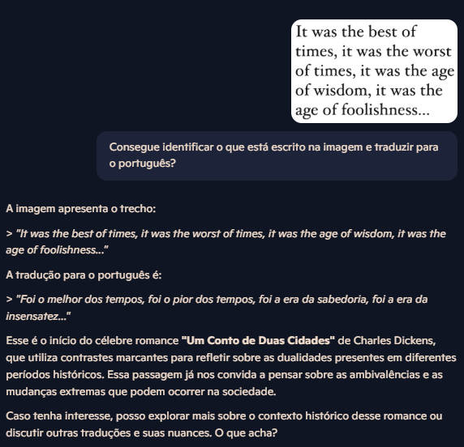
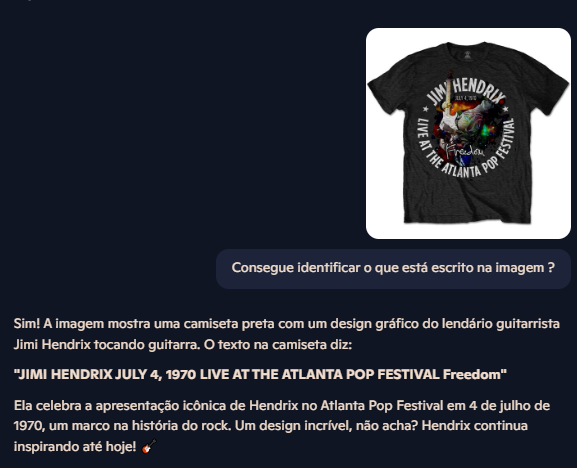
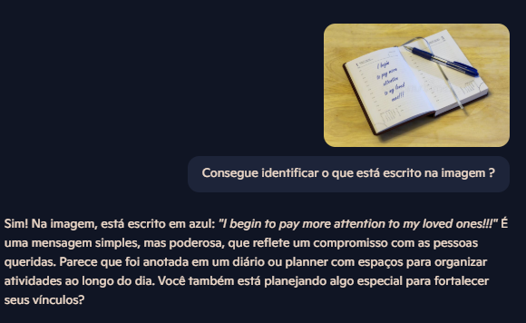

# text-recognition 🧠📷

Este projeto foi desenvolvido como parte do desafio proposto na plataforma DIO. O objetivo foi aplicar os conhecimentos adquiridos sobre **reconhecimento de texto em imagens**, utilizando ferramentas de Inteligência Artificial, e documentar todo o processo em um repositório GitHub.

## 📝 Descrição do Projeto

Neste projeto, explorei o uso de ferramentas de OCR (Reconhecimento Óptico de Caracteres) baseadas em Inteligência Artificial. O processo foi realizado em três etapas principais:

1. **Escolha das imagens**: selecionei imagens com diferentes níveis de complexidade — desde textos simples em imagens até manuscritos e textos en camisetas.
2. **Processamento das imagens com OCR**: utilizei uma ferramenta de OCR para extrair o texto das imagens.
3. **Análise dos resultados**: comparei os textos extraídos com o conteúdo original, verificando a eficácia da ferramenta e identificando pontos de melhoria.

---

## 📸 Exemplos

### Imagem 1 - Texto simples em uma imagem

### Imagem 2 - Texto estilizado em uma Camiseta

### Imagem 3 - Letra manuscrita em um caderno

## 💡 Insights e Aprendizados

- A precisão do reconhecimento para imagens que dão foco ao texto é lida com segurança.
- O reconhecimento é feito com diversos tipos de letras, fontes e estilos.
- Ferramentas de OCR baseadas em IA estão cada vez mais acessíveis e potentes, mesmo para uso gratuito ou em protótipos.

---

## 🚀 Possibilidades Futuras

- Automatizar a extração de texto com scripts Python usando bibliotecas como `Tesseract` ou APIs de OCR.
- Utilizar esse tipo de tecnologia para digitalizar documentos, automatizar tarefas administrativas ou até mesmo desenvolver um leitor inteligente para deficientes visuais.
- Aplicar técnicas de pré-processamento de imagem (como aumento de contraste ou binarização) para melhorar os resultados de OCR.

---